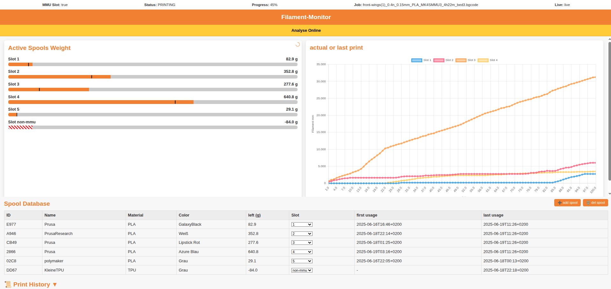
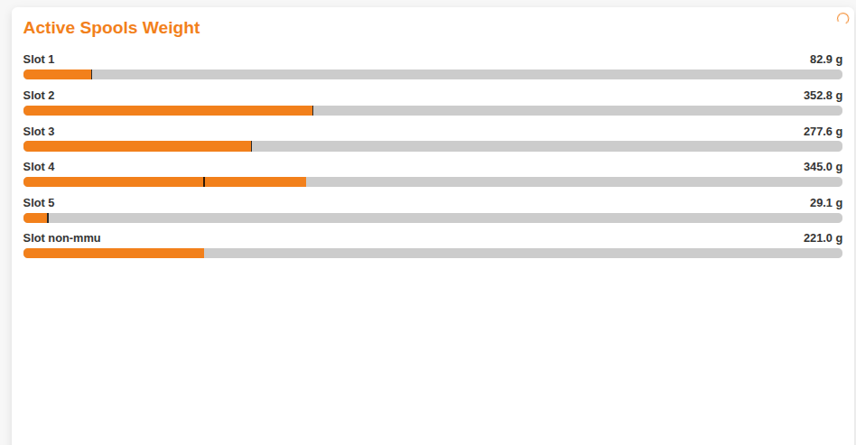
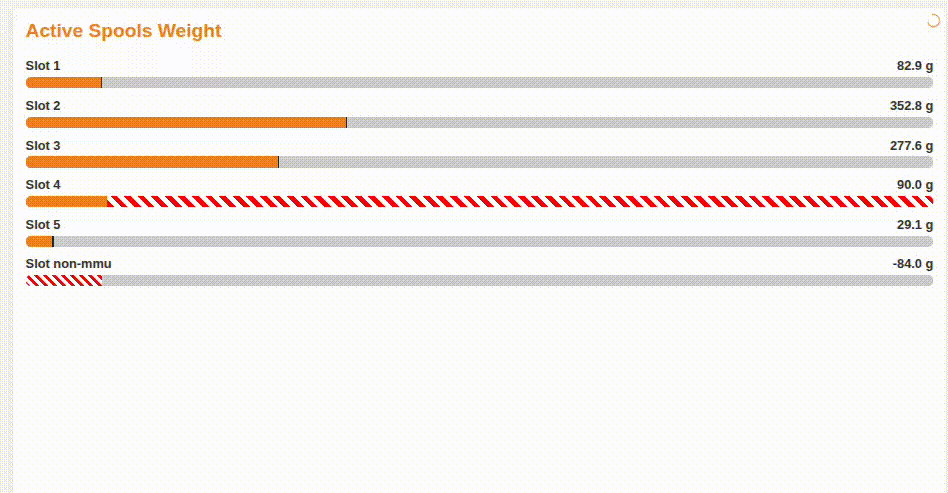
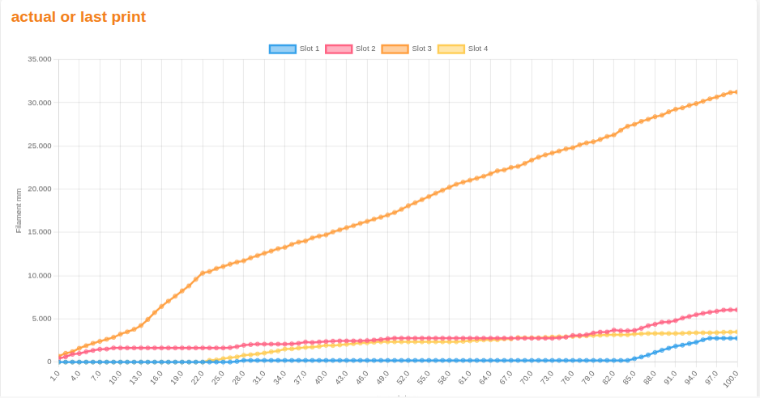
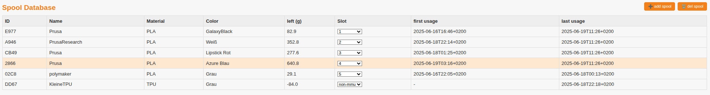
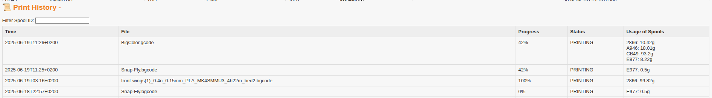

# 📄 Spooli - the smart connected Prusa (MMU) Filament Monitor – System Overview & Installation Guide




This project provides a local monitoring and filament management solution for Prusa 3D printers using MMU3.

Unlike standard printer APIs, this system does not read filament usage directly from the printer, as this data is not exposed by the PrusaLink API. Instead, it achieves accurate tracking through a combination of synchronized live parsing and spool deduction.

When a print starts, the `app.py` backend downloads the active G-code file (as `.bgcode`), parses it line-by-line, and calculates the extrusion per tool. It identifies tool changes and accumulates usage over time. This parsing is done in a dedicated thread and kept synchronized with the live print progress and state received via PrusaLink.

The result: filament usage per tool is accurately tracked and deducted from assigned spools — both for successful and aborted prints.

If the file is streamed directly (e.g. from PrusaSlicer without saving to USB), the `.bgcode` file is not available during print, and live parsing will be "blocked". Once the file becomes available again, usage will be reconstructed based on known progress and comparison to expected values.

A lightweight internal database manages all spools, their remaining weights, material, and color. Each slot (0–4 for MMU tools, 5 for direct mode) can be manually or automatically assigned.

The backend API is designed for easy integration via JSON-based GET and POST endpoints, allowing other tools or interfaces to hook into the spool data.

## 🛠 Current Assumptions
- Designed for Prusa MMU3 systems
- Tested with PrusaSlicer 2.9.2
- Default setup supports 5 MMU slots + 1 fallback slot (non-MMU)

## ✅ Features
- Live parsing of `.bgcode` for per-tool filament usage
- Inline editable spool database (adding and deleting)
- Remaining spool weight deduction with historical log
- Forecasting logic to detect insufficient filament early
- Filterable print history with spool consumption breakdown
- Dynamic reassignment of spools during print (Experimental)

## 🚧 Planned / Missing
- Better logging support for system
- Merging of spools post-print
- MQTT integration
- Prusa Connect API integration (waiting for API docs)
- Frontend settings panel
- G-code compatibility checks

## 🐞 Known Bugs
- Flow Rate change is not calculated. (very rare in gcodes since it is directly calculated in G1/GO E parameters.
- wiping tower and filament stamping before tool change maybe not correct. values are taken from gcode meta data. real use maybe different
- Forecasts can be delayed
- Unexpected restarts or network failures may cause looping

---

## 🧩 Components Overview

The system consists of three main parts:

### 1. `app.py` – Flask Web Backend
- Hosts the UI and APIs
- Manages spool database
- Controls threading and monitoring and Gcode Analysis Loop

### 2. `monitor.py` – Live Print Analyzer
- Downloads and parses G-code (triggered by app.py)
- Tracks tool changes and filament usage
- Feeds usage data to the frontend and database

### 3. `index.html` – Frontend UI
- Displays progress and active tools
- Allows manual editing of spools
- Remapping of Spools
- Presents history and forecasting

### 4. 'settings'
- global variables 
- settings like prusa_usage = False which tells the loop to use prusa slicer estimates if print is successfully. Disabled because priming will not be covered

---

## 🔧 Installation Instructions

```bash
git clone https://github.com/youruser/filament-monitor.git
cd filament-monitor
pip install flask requests pygcode
```

```bash
git clone https://github.com/prusa3d/bgcode.git
cd bgcode
make
sudo cp bgcode /usr/local/bin
```
or check your pacman or aptitude install bgcode

```bash
export PASSWORD="your_prusa_password"
export PRUSA_IP="192.168.1.XXX"
```

---

## 🚀 Running the Monitor

```bash
python3 app.py
```

---

## 📦 Data Files

- `data/spool_db.json`
- `data/print_history.json`

## 🔁 Spool Database Example

---

```json
[
  {
    "id": "A1B2",
    "name": "Prusament PLA",
    "material": "PLA",
    "color": "Galaxy Black",
    "data": {
      "remaining_g": 420.5,
      "first_used": "2025-06-10T15:32+0200",
      "last_used": "2025-06-18T09:41+0200"
      "tare_weight_g": 200.0
    },
    "usage": {
      "slot": 0
    }
  },
  {
    "id": "C3D4",
    "name": "SILK Orange",
    "material": "PLA",
    "color": "Orange",
    "data": {
      "remaining_g": 900.0,
      "first_used": "2025-06-15T12:05+0200",
      "last_used": "2025-06-16T17:20+0200"
      "tare_weight_g": 200.0
    },
    "usage": {
      "slot": 2
    }
  },
  {
    "id": "E5F6",
    "name": "TPU95A Flex",
    "material": "TPU",
    "color": "White",
    "data": {
      "remaining_g": 750.0,
      "first_used": null,
      "last_used": null
      "tare_weight_g": 200.0
    },
    "usage": {
      "slot": null
    }
  }
]
```

## 🔁 Print History Example

```json
{
  "timestamp": "2025-06-16T13:22+0200",
  "file": "example.gcode",
  "progress": 100,
  "status": "FINISHED",
  "spools": {
    "AB12": 57.4,
    "CD34": 12.1
  }
}
```

---

## 🧭 Backend API Reference

| Endpoint                       | Method | Description |
|-------------------------------|--------|-------------|
| `/`                           | GET    | UI |
| `/status`                    | GET    | Printer state |
| `/data`                      | GET    | Usage history |
| `/spools`                    | GET    | Spool list |
| `/spool_weights`             | GET    | Active spool weights |
| `/add_spool`                 | POST   | Add spool |
| `/delete_spool/<id>`         | POST   | Delete spool |
| `/update_spool`              | POST   | Update spool field |
| `/set_spool_weight/<slot>/<g>` | POST | Set slot weight |
| `/refill`                    | POST   | Apply usage data |
| `/reset`                     | GET    | Reset weights |
| `/history`                   | GET    | Full history |
| `/history_by_spool/<id>`     | GET    | History by spool |
| `/noti`                      | GET    | Notification |
| `/prognosis`                 | GET    | Forecast remaining weight |
| `/slot_override`                 | GET    | Get Spool remapping |
| `/slot_override`                 | POST    | Set Spool remapping |

### 🔧 POST Request Examples

```json
{
  "id": "AB12",
  "field": "remaining_g",
  "value": "435.0"
}
```

---

## 🚩 Systemd Autostart

```ini
[Unit]
Description=Prusa MMU3 Filament Monitor
After=network.target

[Service]
ExecStart=/usr/bin/python3 /path/to/filament-monitor/app.py
WorkingDirectory=/path/to/filament-monitor
Environment=PRUSA_IP=printers_ip
Environment=PASSWORD=your_password not token 
Restart=always
User=pi

[Install]
WantedBy=multi-user.target
```

---

## 🖼 Frontend Explained

Top Cards: Show active spools and live chart of filament usage (mm vs. % progress)
Bottom shows spools and history 



Forecasting: /prognosis returns expected consumption to warn early if filament is insufficient
The black line indicates the usage for 100% of the current print 
White Red bars highlights negative spools. means there was an calculation error or another spool joined the tool. this can be manually solved with the spool database weight manipulation.
White Red Blinking bars means the print with this specific spool will result in an end of spool BEFORE print ends.

This graphic is the main output of the consumption algorithm and can be used as a live visualization or print overview 


Slot Mapping amd spool database: Maps internal slots 0–5 to frontend view 1–6 (slot 5 → "non-mmu")
Inline Editing: Supports editing fields like remaining weight, name, color. simple +/- formulas are allowed in the weight cell.


Csn be expanded by clicking 
History Table: Stores and displays past print jobs with filterable spool ID, status, file


Warning Banner: /noti dynamically shows info banners like "no sync", "analyze offline", etc.

Progress Indicators(at the very top) Frontend highlights blocked state and informs printing status. Note: if the live status calls "blocked" than the gcode is locked by prusa printer and will be available after the printing. means your consumption will be tracked after the print finished or aborted 


---

## ⚠️ Notes

- Real-time syncing requires `tool_live = 'live'`
- `bgcode` required for parsing
- Works for MMU3 and single-tool setups
- Data polling every 5 seconds

---

## 📜 License

MIT License

---

## 🙋 Feedback

Submit issues or PRs via GitHub.
